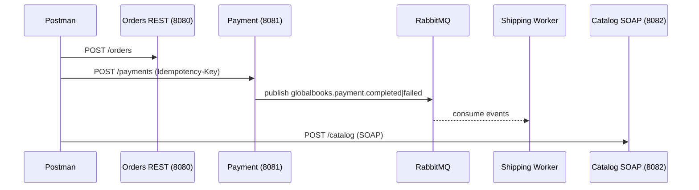

# GlobalBooks Postman Guide

Purpose
- How to call each service using Postman: Orders (REST), Payments (REST), Catalog (SOAP), Shipping (AMQP worker).
- Ports are defined in docker-compose.

Prerequisites
- Start stack: docker compose up -d
- Verify services:
  - Orders: http://localhost:8080
  - Payments: http://localhost:8081
  - Catalog SOAP: http://localhost:8082/catalog (WSDL at ?wsdl)
  - Shipping: worker only (no HTTP); view container logs

Postman environment variables (recommended)
- base_orders = http://localhost:8080
- base_payments = http://localhost:8081
- base_catalog = http://localhost:8082
- correlationId = any UUID string (optional, for tracing)

Orders REST (Spring Boot)
- Base: {{base_orders}}
- Endpoints:
  - POST /orders
  - GET /orders/{id}
- Create Order request
  - Method: POST
  - URL: {{base_orders}}/orders
  - Headers:
    - Content-Type: application/json
  - Body (raw JSON):
```json
{
  "customerName": "John Doe",
  "items": [
    { "id": 1, "name": "Java Programming", "quantity": 1, "price": 29.99 }
  ],
  "total": 29.99,
  "status": "Pending"
}
```
- Get Order by ID
  - Method: GET
  - URL: {{base_orders}}/orders/1

Payment Service (Spring Boot)
- Base: {{base_payments}}
- Security:
  - Dev profile permits all requests (no auth). Idempotency-Key header is required for create.
- Endpoints:
  - POST /payments
  - GET /payments/{paymentId}
  - POST /payments/{paymentId}/refund
  - POST /payments/webhooks/payments?providerRef=...&status=...
- Create Payment
  - Method: POST
  - URL: {{base_payments}}/payments
  - Headers:
    - Content-Type: application/json
    - Idempotency-Key: 7b5c9a5a-45d9-4b7f-b0c0-ff1a9c6b0f90
    - X-Correlation-Id: {{correlationId}} (optional)
  - Body (raw JSON):
```json
{
  "orderId": "ORD-1001",
  "amount": 49.99,
  "currency": "USD",
  "paymentMethodToken": "tok_test_visa"
}
```
- Get Payment
  - Method: GET
  - URL: {{base_payments}}/payments/{paymentId}
- Refund Payment
  - Method: POST
  - URL: {{base_payments}}/payments/{paymentId}/refund
- Simulate Provider Webhook
  - Method: POST
  - URL: {{base_payments}}/payments/webhooks/payments?providerRef=abc123&status=completed
  - Headers:
    - X-Signature: valid

Catalog SOAP (JAX-WS)
- Base: {{base_catalog}}
- WSDL: GET {{base_catalog}}/catalog?wsdl
- Endpoint: POST {{base_catalog}}/catalog
- Headers:
  - Content-Type: text/xml;charset=UTF-8
  - SOAPAction: "" (empty)
- Request: getBookById
```xml
<?xml version="1.0" encoding="UTF-8"?>
<soapenv:Envelope xmlns:soapenv="http://schemas.xmlsoap.org/soap/envelope/"
                  xmlns:cat="http://globalbooks.com/catalog">
  <soapenv:Header/>
  <soapenv:Body>
    <cat:getBookById>
      <id>1</id>
    </cat:getBookById>
  </soapenv:Body>
</soapenv:Envelope>
```
- Request: getBooksByCategory
```xml
<?xml version="1.0" encoding="UTF-8"?>
<soapenv:Envelope xmlns:soapenv="http://schemas.xmlsoap.org/soap/envelope/"
                  xmlns:cat="http://globalbooks.com/catalog">
  <soapenv:Header/>
  <soapenv:Body>
    <cat:getBooksByCategory>
      <category>Technology</category>
    </cat:getBooksByCategory>
  </soapenv:Body>
</soapenv:Envelope>
```

Shipping Worker (Node.js)
- No HTTP endpoints; consumes RabbitMQ events published by the Payment Service.
- To exercise, create a payment via POST {{base_payments}}/payments and watch the shipping-service container logs.

Sequence overview


Export this guide to PDF (VS Code)
- Install the "Markdown PDF" extension by yzane
- Open this file: report/GlobalBooks_Postman_Guide.md
- Right-click in the editor and choose: Markdown PDF: Export (pdf)
- Output will be saved as ./report/GlobalBooks_Postman_Guide.pdf (you can change the folder in the save dialog)